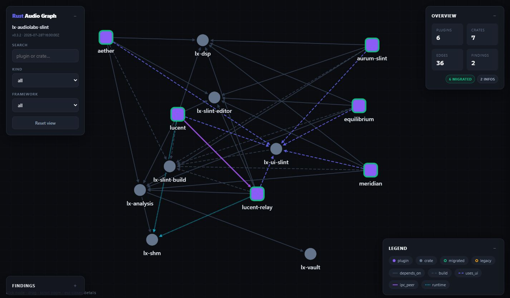
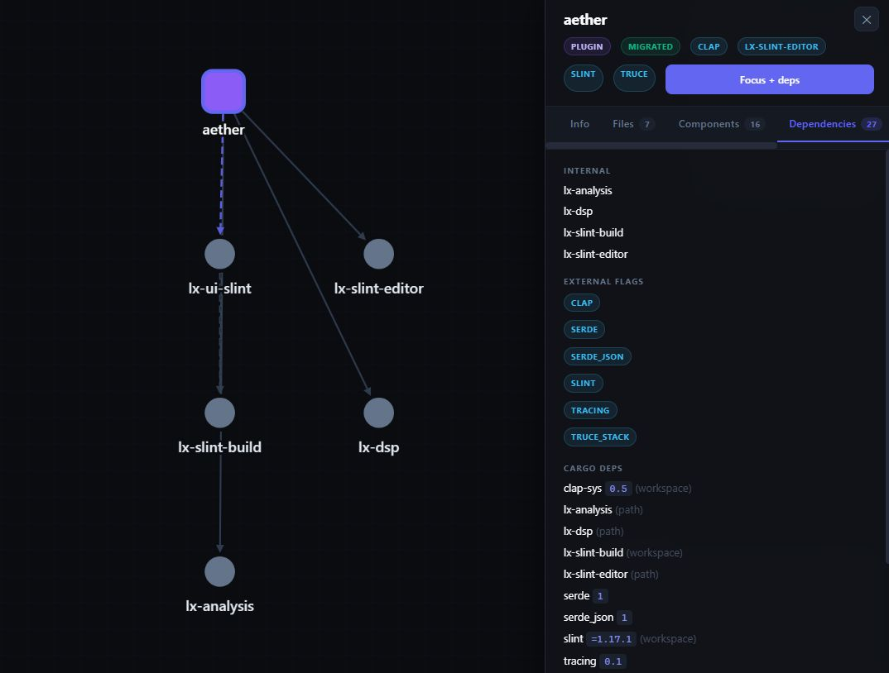

# agentic-audiolab (`agal`)

**Summary:** Orientation layer for AI-assisted Rust audio workspaces — graph,
hybrid notes, curated + workspace skills, structural findings with health gate.

## Names (one product)

| | |
|--|--|
| **Crate / folder** | `agentic-audiolab` |
| **Binary** | **`agal`** |
| **Output folder** | `agal/` (default) |
| **Config** | `agal.toml` next to root `Cargo.toml` |


## Scope (honest)

**Best support:** monorepos shaped like **LX Audiolabs** — `plugins/` + `crates/`,
**truce** + **Slint** + shared UI (`Lx*`) + optional SHM/relay. Zero-config still
applies a default editor migration: `truce-slint` → `lx-slint-editor` (override or
extend in `agal.toml`).

**Best-effort elsewhere:** nih-plug / nice-plug / clack / generic Cargo workspaces
via config + taxonomy. Heuristics and findings are weaker off the dogfood path.

Does **not** replace Clippy, clap-validator, or a full knowledge graph (graphify).
Three layers: **structure (agal)** · **Rust lint (Clippy)** · **CLAP binary (validator)**.

## Install

```bash
cd /path/to/Agentic\ Audiolab
cargo install --path . --force   # installs `agal` on PATH
```

## Usage

```bash
cd /path/to/your-plugin-workspace
agal .
```

### Output (`agal/` by default)

| File | Who | Purpose |
|------|-----|---------|
| **`AGAL.md`** | AI first | **agal entry** — skills index + hot path (regenerated; never hand-edit) |
| `Cheatsheet.md` | human | CLI + workflow (regenerated) |
| `agal.agent.md` | AI | structural map + **health** (~1–3k tokens); error/warn findings only |
| `agal.delta.md` | both | structural changes since last generate |
| `agal.json` | AI escalate | edges, params, **all** findings (`path` / `fix`) |
| `agal.html` | human | overview graph (plugins + hubs) |
| `notes/<name>.md` | both | auto header + **human body preserved** |
| `notes/_index.md` | human | note index |
| `<plugin>.slice.json` | AI | create with `--plugin`; **refreshed** on every later `agal .` |
| `skills/` | AI | tool packs only (`agal skills sync`) |

```bash
agal .                        # map + notes + html + Cheatsheet (+ refresh existing slices)
agal --plugin aether .        # + create/update one-hop slice
agal -v .                     # verbose JSON
agal --watch .                # regenerate on .rs / Cargo.toml / .slint
agal --install-hook .         # post-commit regenerate
agal -o other-dir .           # custom output dir
agal --agent-only .           # skip HTML

agal skills list
agal skills sync              # default: core (DSP constitution)
agal skills sync --preset slint-ui   # loadout: core + ui/slint
agal skills sync --only policy
agal skills sync --only ui/slint
agal skills sync --only core,ui/slint,formats/clap
agal skills sync --only all --force

agal doctor                   # Clippy + clap-validator + optional symbol tools on PATH
```

### Agent hot path

**Disclosure (L3→L0):** open the next layer only if the current one is not enough.

| Layer | Artifact |
|-------|----------|
| **L3** | `agal/AGAL.md` — entry, focus strip, equipped skills, budget, loadouts |
| **L2** | `agal.agent.md` (+ `delta`) — map + health |
| **L1** | `notes/<focus>.md` — one note; scan `[ATOM]` first |
| **L0** | slice / `agal.json` — escalate only |
| loadout | ≤1 skill (match `triggers`) |
| durable | `notes/_workspace.md` — never overwritten |

1. **L3** `AGAL.md`
2. **L2** `agal.agent.md` — **health** (`ok` / `degraded` / `blocked`)
3. If **blocked** → fix **error** findings first (`path` + `fix`)
4. **L2** `agal.delta.md`
5. **L1** `notes/<focus>.md` (**one** plugin or crate)
6. **loadout** from pack list in `AGAL.md` — **≤1** skill file default
7. **L0** slice / `agal.json` only when escalating

**Per-turn budget:** 1 focus note · ≤1 skill file · errors before warns · JSON only when escalating.  
**Loadouts** (sync once): `core` · `policy` · `core,ui/slint` · `core,formats/clap` · `agents` — full table in `AGAL.md`.  
**Stack:** agal (structure) · Clippy · clap-validator · optional symbol tools (not agal).  
**Notes atoms:** graph atoms (auto, in note AUTO block) + optional human `[ATOM]` below HUMAN marker.

### Root `AGENTS.md` (yours) vs `AGAL.md` (agal)

agal is **non-intrusive**: it never overwrites the workspace-root `AGENTS.md`.  
Users keep product rules there and add a one-line pointer:

```markdown
## Orientation (agal)
Read **`agal/AGAL.md`** first for map, health, and skills.
```

### Skills (tool packs)

| Kind | Path | Who writes | Sync |
|------|------|------------|------|
| **Core** (default) | `skills/00-core/` | `agal skills sync` | domain constitution |
| **Opt-in packs** | `skills/01-policy/` … `06-agents/` | `agal skills sync --only …` | catalog only |

- **Load on demand** — never dump `skills/` into context.
- Live index regenerated into **`AGAL.md`** on every `agal .` and `agal skills sync`.
- Without `--force`, existing skill files are **skipped** (local adaptations kept).
- Prefer adapting pack files in place; do **not** invent root `*_SKILL.md`.

Canonical skill packs live in this tool repo (`skills/`). Workspaces get a curated
copy via CLI — not on every generate (avoids MCP-style context bloat).

### gitignore

**Simple** (everything local, nothing versioned under `agal/`):

```gitignore
/agal
```

Optional: version adapted skill packs while keeping graph/notes local:

```gitignore
/agal/*
!/agal/skills/
```

## What it detects

- **Plugin vs crate** (`plugins/` / `crates/`)
- **Frameworks on nodes** (deps/imports) → `used_frameworks` / agent **“frameworks detected”**  
  (migration endpoints from config are **not** injected into that list)
- **Frameworks (strength):** truce strong; nih-plug, clack, … best-effort
- **UI stacks:** Slint (deep), egui / Iced / Vizia / baseview (lighter)
- **Editor adapters** + migrations (default dogfood: truce-slint → lx-slint-editor)
- **Formats:** CLAP, VST3, LV2
- **Cargo edges** + semantic: `uses_ui`, `ipc_peer`, `runtime_depends_on`
- **AST:** PluginLogic, Params, process/editor hooks, framework macros
- **Integrity:** missing workspace members, packages outside workspace, required deps
- **Findings** with optional `path` + `fix`; **suppress** via config
- **Tool hints** (info): Clippy, clap-validator — not executed on generate; optional symbol tools are doctor-only

## Configuration (`agal.toml`)

All fields optional. See also `examples/agal.toml`.

### Minimal (any workspace)

```toml
output_dir = "agal"

# Optional: name migrations yourself (from → to editor / adapter ids)
# [migrations.old-editor]
# from = "old-editor"
# to = "new-editor"

# [rules]
# crate_vs_plugin = "Reusable logic in crates/, product logic in plugins/."

# [[suppress]]
# code = "large_param_surface"
# node = "my-plugin"    # name, path, or id; omit / "*" = all
# reason = "intentional product surface"
```

### Dogfood example (LX / truce + Slint)

Zero-config already assumes the truce-slint migration. Explicit form:

```toml
project_name = "My Plugins"
output_dir = "agal"

ui_crates = ["lx-ui-slint"]
ipc_hubs = ["lx-shm", "lx-analysis"]

[migrations.truce-slint]
from = "truce-slint"
to = "lx-slint-editor"

[rules]
plugin_target_editor = "Plugins should use lx-slint-editor, not truce-slint."
crate_vs_plugin = "Reusable logic in crates/, product logic in plugins/."

[[suppress]]
code = "large_param_surface"
node = "aurum-slint"
reason = "product surface intentional"
```

## Health & findings

| health | Meaning |
|--------|---------|
| **ok** | no error / warn |
| **degraded** | warnings only |
| **blocked** | any error |

`agal.agent.md` lists **error + warn** only. Info (tool hints, large param
surface, …) stays in JSON/HTML unless suppressed.

When `[[suppress]]` mutes findings:

- JSON: `findings_suppressed` count
- agent.md header: `suppressed: N (see agal.toml)` — health can stay **ok** without hiding that noise was muted

### Finding codes (selection)

| Code | Severity | Meaning |
|------|----------|---------|
| `workspace_member_missing` | error | member path / glob base missing |
| `plugin_not_in_workspace` | warn | `plugins/*` package not a workspace member |
| `package_not_in_workspace` | warn | `crates/*` package not a workspace member |
| `required_dep_missing` | warn | Slint without editor crate, or IPC without hub link |
| `migration_legacy` | error | still on legacy editor adapter |
| `logic_macro_mismatch` | error | PluginLogic ≠ framework macro logic |
| `mixed_editor_adapters` | warn | multiple editor adapters imported |
| `missing_process_hook` | warn | PluginLogic without process |
| `params_unbound` | warn/info | params never referenced outside def |
| `ipc_single_peer` | warn | only one plugin has shm/relay |
| `large_param_surface` | info | many visible params |
| `dsp_process_methods` | info | crate has many methods named `process` |
| `tool_hint_clippy` | info | run workspace Clippy (not executed by agal) |
| `tool_hint_clap_validator` | info | validate built `.clap` after compile |

## Output schema (v0.4)

```text
version, generated_at, project_root, project_name
used_frameworks[]   # detected on nodes only (not unused migration endpoints)
frameworks[]
nodes[]: id, name, kind, path, frameworks, migration_status,
         internal_deps, external_flags, dependency_names? (-v),
         ast_summary { … }, dependency_details? (-v)
edges[]: from, to, kind, note?
findings[]: severity, code, node?, message, path?, fix?
findings_suppressed  # count omitted by [[suppress]] (agent.md shows when >0)
migration_summary, rules
delta?: { added/removed/changed nodes, edges, new/resolved findings }
```

Default JSON is slim (no bulk `dependency_details` / symbols unless `-v`).

## HTML

Open `agal/agal.html`:

- overview: plugins + hub crates (progressive disclosure)
- edge colors: cargo / uses_ui / ipc_peer / runtime
- findings sidebar (info opt-in)
- focus = plugin + 1-hop

## Integration snippet (AGENTS.md)

```markdown
## Orientation (agal)
Read **`agal/AGAL.md`** first for map, health, and skills.
If blocked, fix error findings (`path` + `fix`) before feature work.
Then agent map → delta → notes/<focus> → skills on demand (packs under skills/).
Escalate: `agal --plugin NAME .` or `agal.json`.
Config: `agal.toml` (`[[suppress]]` for intentional noise).
Regenerate: `agal .`  |  doctor: `agal doctor`  |  core skills: `agal skills sync`
```

## Independent of graphify

`agal` does not read `graphify-out/`. Use graphify only for deep non-audio symbol
search. There is no “run graphify first” step.

## Develop / CI

```bash
cargo test --workspace
cargo clippy --workspace --all-targets -- -D warnings
cargo fmt --all -- --check
```

CI: `.github/workflows/ci.yml` (fmt + clippy + test).

## Screenshots





(Filenames are historical; product name is **agentic-audiolab** / **`agal`**.)

## License

**GPL-3.0-or-later** — see [`LICENSE`](./LICENSE).

Free to use, modify, and distribute (including commercially) under the GPL:
source must stay available under the same terms. Generated workspace notes/maps
are your content, not automatically GPL.

Stack matrix (AGAL + AURA + plugins + Slint):  
`LX-Audiolabs/AURA/docs/licensing-compliance.md` (when present in monorepo layout).
